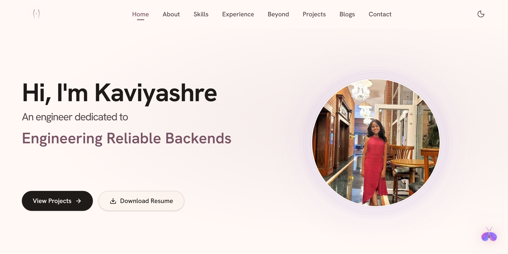
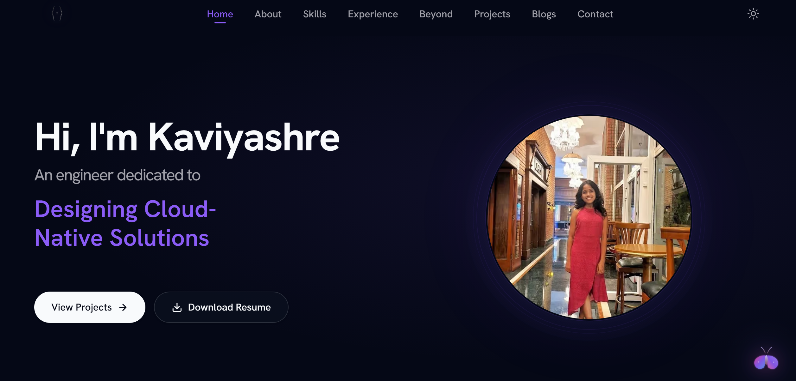
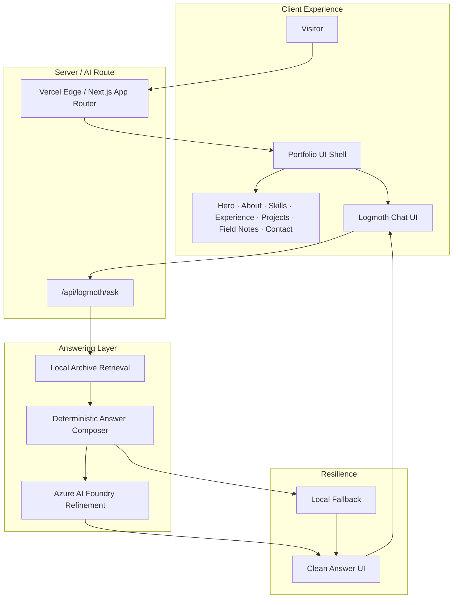
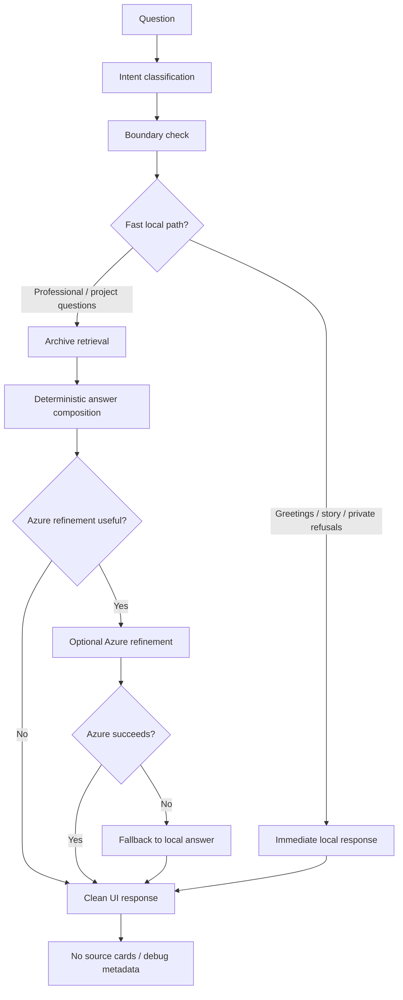
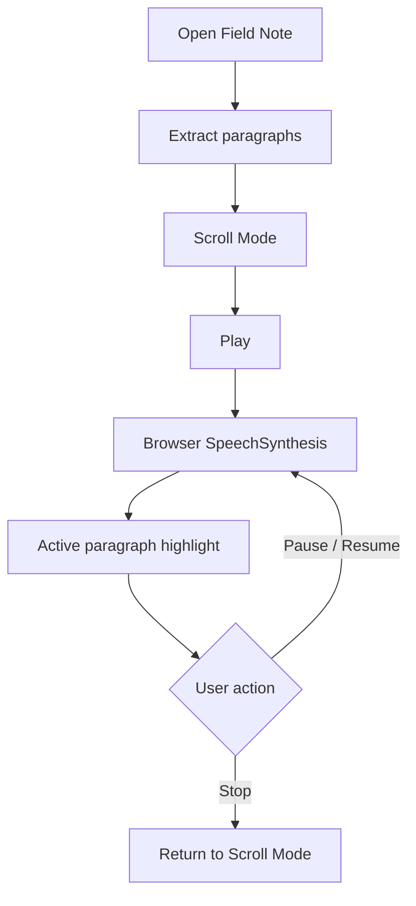
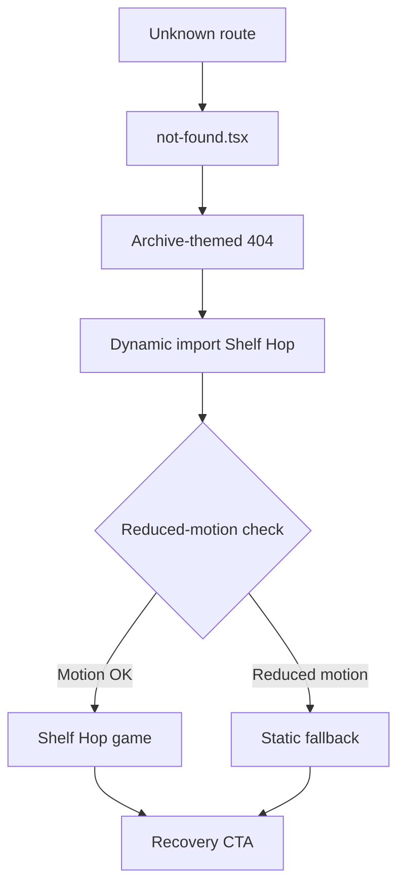
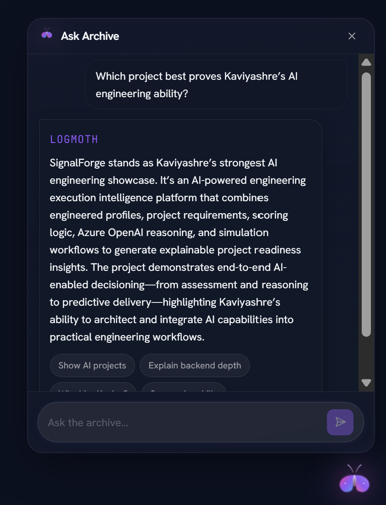
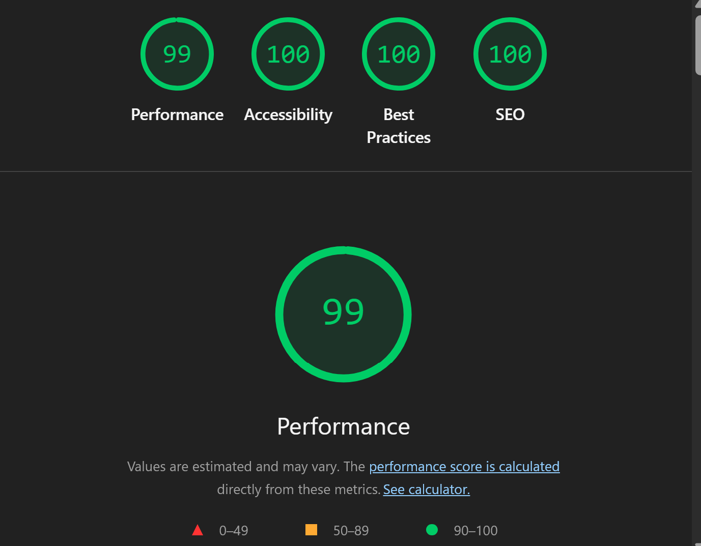
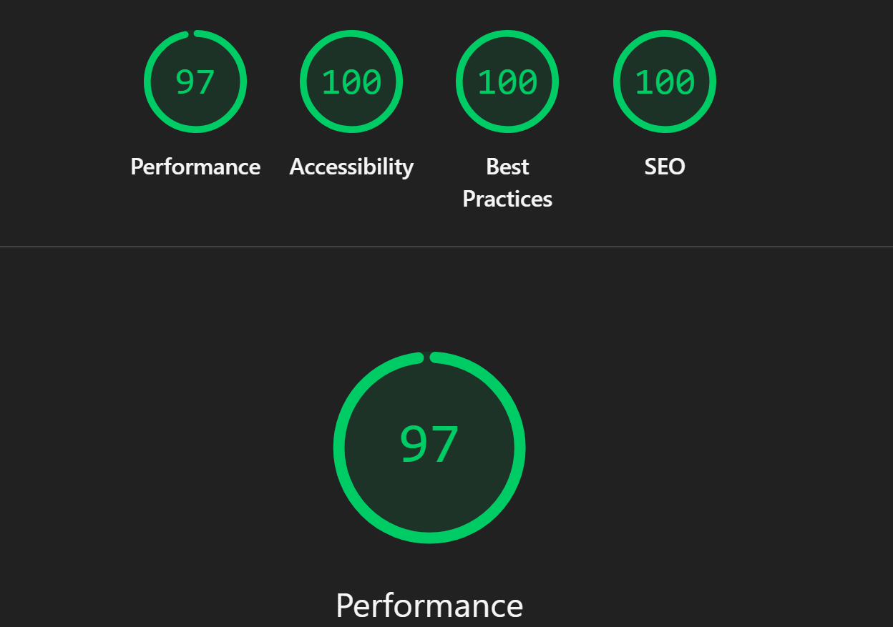

# The Build Archive

This is not a static resume site.

**The Build Archive** is a polished archive surface: editorial storytelling for recruiters who need to scan fast, case-study depth for engineers who want to go further, and a grounded AI assistant for visitors who want to ask questions without booking a call.

It combines portfolio narrative, system design, grounded AI interaction, and production QA into one product experience — premium, minimal, slightly strange, and deliberately not template-like.

**Live:** [kaviyashre-portfolio.vercel.app](https://kaviyashre-portfolio.vercel.app/)
  

> [!NOTE]
> This repository is a **public showcase**, not the production codebase.  
> The Build Archive’s source code is private because it contains implementation details and private configuration. This repo exists to document the product thinking, architecture, AI system design, visual assets, and launch-readiness proof behind the live portfolio.

---

## Visual walkthrough

| Moment | Preview | What this proves |
|---|---|---|
| **Homepage overview** |  | Editorial single-page polish and recruiter scanability |
| **Logmoth interaction** |  | AI UX integrated into the archive, not bolted on |
| **Blog narration** |  | Browser-native reading experience without paid TTS |
| **Project modal** |  | Case-study depth without leaving the page |
| **Theme switch** | Soft mode · Space mode   | Dual-theme identity without a theme-switch GIF yet |
| **Error page** |  | Branded recovery isolated from the homepage bundle |
| **Architecture flow** |  | End-to-end product and answering pipeline story |

---

## Core feature overview

| Layer | Feature |
|---|---|
| Portfolio shell | Editorial single-page archive |
| AI layer | Ask The Archive | 
| Retrieval | Local deterministic archive search | 
| AI refinement | Azure AI Foundry refinement |
| Narration | Browser-native Web Speech API |
| Error states | Custom 404/error + Shelf Hop | 
| Performance | Lazy-loading + CLS/LCP work | 
| Safety | Private-boundary refusals | 

---

## Architecture and system design

The Build Archive runs as a Next.js 16 App Router product on Vercel. The UI is an editorial single-page shell. Logmoth questions leave the browser only through a server route, where local retrieval and a deterministic composer produce the answer before optional Azure refinement.

### High-level product architecture

### Logmoth answering pipeline

### Blog narration flow

### Error page lazy-load flow

Frame notes → [architecture-flow-storyboard.md](./assets/diagrams/architecture-flow-storyboard.md)

Deeper system notes → [docs/architecture.md](./docs/architecture.md)

---

## Ask The Archive

**Logmoth** is the archive-native assistant. It is not a support chatbot and not a generic ChatGPT wrapper. It answers public-safe questions about projects, experience, skills, role-fit, personality, field notes, and build history — grounded in a local archive before any cloud call.

**How it answers**

1. Classify intent and check private boundaries
2. Fast-path greetings, story prompts, and refusals locally
3. Retrieve relevant public archive records for professional/project questions
4. Compose a deterministic answer from those records
5. Optionally refine wording with Azure AI Foundry when useful
6. Fall back to the local composed answer if Azure fails
7. Return a clean answer UI — no confidence scores, source cards, or debug metadata

**Internal modes** (inferred from the question)

| Mode | Purpose |
|---|---|
| **Default Mode** | General project, skill, and experience questions |
| **Recruiter Mode** | Role-fit, strengths, and hiring-relevant framing |
| **Story Mode** | Personality, build history, and narrative questions |

**Product constraints**

- Local deterministic retrieval first
- Azure refinement is optional polish, not a dependency
- Private / inappropriate / out-of-scope prompts are refused
- No chat TTS — Logmoth answers are read, not spoken
- No raw prompts, private archive content, or implementation leakage in the public UI

Full AI system notes → [docs/ai-system.md](./docs/ai-system.md)

---

## Blog narration

Field notes use the browser-native **Web Speech API**

---

## Performance, SEO, and accessibility

Final QA proof against production:

### Desktop

| Metric | Score |
|---|---|
| Performance | **98** |
| Accessibility | **100** |
| Best Practices | **100** |
| SEO | **100** |
| CLS | **0.087** |

### Mobile

| Metric | Score |
|---|---|
| Performance | **86** |
| Accessibility | **100** |
| Best Practices | **100** |
| SEO | **100** |
| CLS | **0.078** |

**What the scores reflect**

- Metadata and canonical URL aligned to the production URL
- Sitemap / robots readiness
- Open Graph / Twitter readiness
- Optimized images with hero priority / `fetchPriority`
- Lazy-loaded below-fold sections
- CLS held below 0.1 on both form factors
- Logmoth kept lightweight on initial load
- Shelf Hop isolated to error pages only
- Accessibility score 100 with reduced-motion support and keyboard/focus care

Full QA checklist → [docs/qa-summary.md](./docs/qa-summary.md)

---

## Design system

**Identity:** premium · minimal · editorial · technical · soft · slightly strange · archive-native · recruiter-ready

Not template-like. Not SaaS-generic. Not support-chatbot-like.

| Token | Role |
|---|---|
| Archive background | Main Soft-mode page surface |
| Ink foreground | Primary text |
| Moth glow | Logmoth accent and interactive highlights |
| Soft card | Project tiles and archive surfaces |
| Space mode surface | Dark theme background |
| Border haze | Subtle dividers and card edges |
| Editorial accent | Emphasis in headlines and active states |

| Mode | Character |
|---|---|
| **Soft mode** | Warm, editorial, archive-paper feel |
| **Space mode** | Deep surfaces, moth glow accents, night-archive atmosphere |

Exact hex values are kept in production CSS and are not invented here. Full design notes → [docs/design-system.md](./docs/design-system.md)

---

## Visual asset inventory

| Asset | File used | Purpose |
|---|---|---|
| Hero preview | `assets/hero/build-archive-preview.gif` (+ `.mp4`) | Cinematic README open |
| Homepage overview | `assets/gifs/homepage-overview.gif` (+ `.mp4`) | Full-page product polish |
| Logmoth interaction | `assets/gifs/logmoth-interaction.gif` (+ `.mp4`) | Grounded AI UX walkthrough |
| Blog narration | `assets/gifs/blog-narration.gif` (+ `.mp4`) | Web Speech reading experience |
| Project modal | `assets/gifs/project-modal.gif` (+ `.mp4`) | Case-study storytelling |
| Error page / Shelf Hop | `assets/gifs/error-page-game.gif` (+ `.mp4`) | Branded 404 recovery |
| Architecture flow | `assets/gifs/architecture-flow.gif` (+ `.mp4`) | System pipeline animation |
| Theme proof (static) | `homepage-desktop-light.png` / `homepage-desktop-space.png` | Soft ↔ Space identity |
| Logmoth answer proof | `logmoth-recruiter-answer.png` | Clean recruiter-mode UI |
| Blog narration proof | `blog-narration-modal.png` | Narration controls / highlight |
| Lighthouse desktop | `lighthouse-desktop.png` | Desktop QA proof |
| Lighthouse mobile | `lighthouse-mobile.png` | Mobile QA proof |

Capture plan and missing optional assets → [docs/visual-asset-plan.md](./docs/visual-asset-plan.md)

---

## Documentation

| Document | Description |
|---|---|
| [Case study](./docs/case-study.md) | Why it exists, product thinking, outcome |
| [Architecture](./docs/architecture.md) | System design and flow diagrams |
| [AI system](./docs/ai-system.md) | Logmoth pipeline, retrieval, safety |
| [Design system](./docs/design-system.md) | Brand, tokens, motion, accessibility |
| [QA summary](./docs/qa-summary.md) | Lighthouse, security, readiness |
| [Visual asset plan](./docs/visual-asset-plan.md) | Asset inventory and capture specs |
| [Architecture storyboard](./assets/diagrams/architecture-flow-storyboard.md) | Frame-by-frame animation notes |

---

## What this demonstrates

- **AI product design** — an assistant that feels native to the portfolio
- **Retrieval thinking** — local deterministic archive search before any LLM call
- **LLM orchestration** — compose first, refine when useful, fall back when Azure fails
- **Safe assistant design** — refusals, private boundaries, no debug leakage
- **Frontend AI UX** — clean answers without source cards or raw prompts
- **Production Next.js** — App Router, lazy sections, isolated error-page bundles
- **Performance and accessibility discipline** — final QA scores above, CLS under 0.1
- **Cloud product thinking** — Azure AI Foundry with graceful degradation
- **Recruiter-facing storytelling** — scannable layout, case-study modals, role-fit answers
- **Full-stack ownership** — design, build, QA, deploy, and document end to end

---
