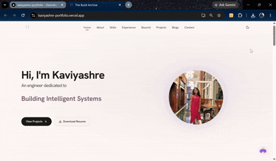
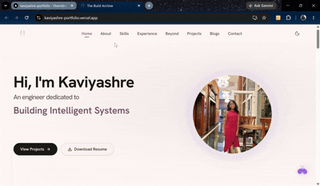
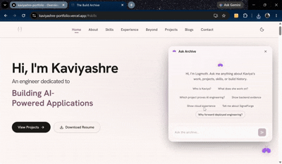
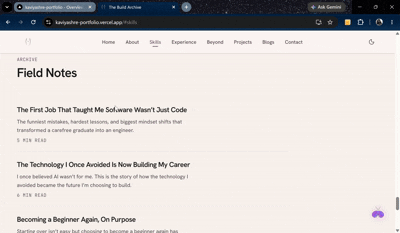
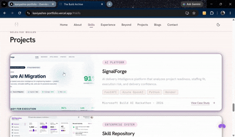
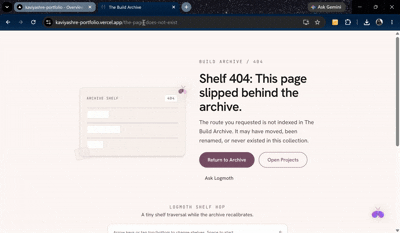
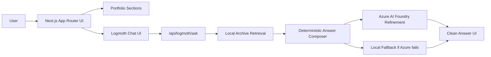
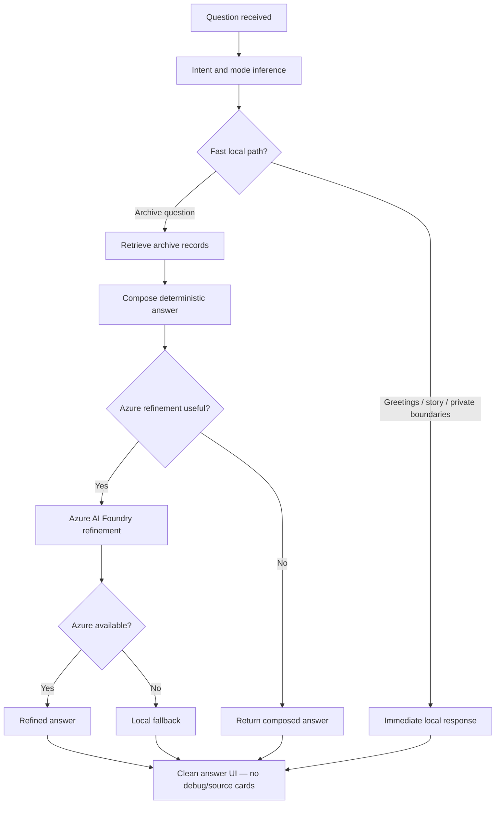
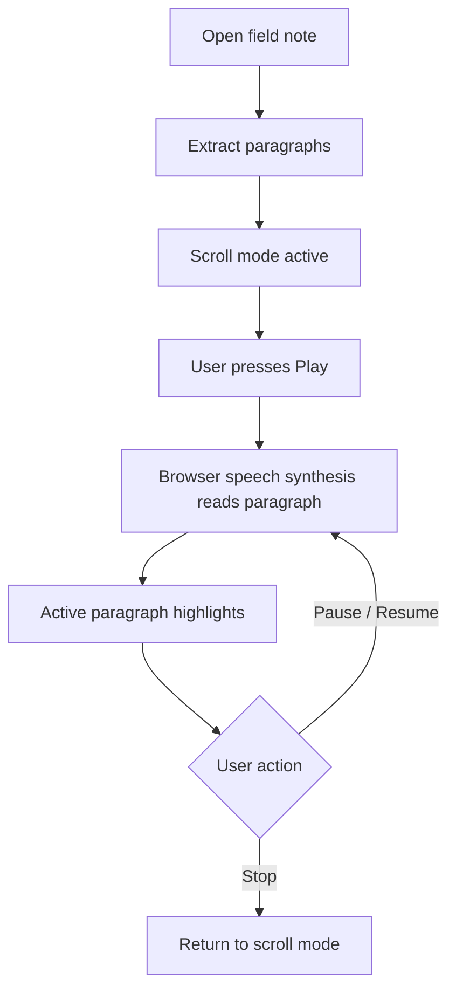
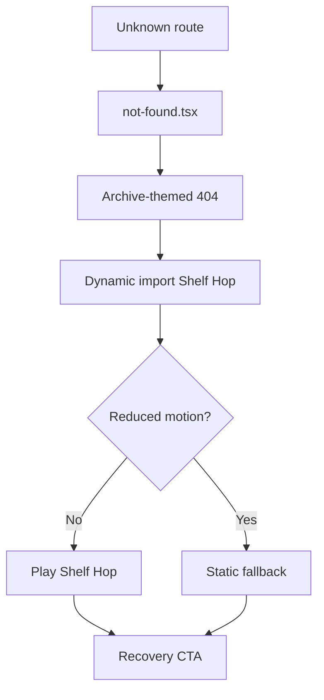

# The Build Archive

**AI-native personal portfolio**

> A portfolio designed as a product: part personal archive, part AI assistant, part technical case study.

> **Source code privacy:** Production source code is private. This repository is a public-safe showcase — architecture, case studies, QA proof, and visual documentation only.

*Preview GIF to be added after final screen capture.*

---

## The portfolio is the product.

This is not a static resume site. **The Build Archive** is a product-style portfolio that treats personal storytelling, technical case studies, and grounded AI interaction as first-class features — not afterthoughts.

Visitors get an editorial, recruiter-scannable experience. Recruiters can skim projects and experience in seconds. Curious visitors can ask **Logmoth** (the archive-native assistant) role-fit and project questions. Engineers can read the architecture, performance work, and AI pipeline decisions documented here.

The result: a portfolio that reads like a shipped product — premium, minimal, slightly strange, and deliberately not template-like.

---

## Visual walkthrough

| Moment | Preview | What it proves |
|---|---|---|
| Homepage overview |  | Product polish and visual identity |
| Logmoth interaction |  | AI UX and grounded assistant design |
| Blog narration |  | Browser-native narration and reading experience |
| Project modal |  | Case-study storytelling |
| Error page game |  | Branded polish without homepage bundle cost |

---

## Core features

| Layer | Feature | Why it matters |
|---|---|---|
| Portfolio shell | Editorial single-page experience | Recruiters can scan quickly |
| AI layer | Logmoth / Ask The Archive | Visitors can ask role-fit and project questions |
| Retrieval | Local deterministic archive search | Fast, grounded, fallback-safe answers |
| AI refinement | Azure AI Foundry refinement | Better wording for professional answers |
| Narration | Browser Web Speech API | Free blog narration without paid TTS |
| Performance | Lazy loading and LCP/CLS work | Production-grade user experience |
| Error states | Custom 404/error pages + Shelf Hop | Polished recovery experience |
| Safety | Refusals and private-boundary logic | Public-safe AI assistant behavior |

---

## High-level architecture

---

## Logmoth pipeline

**Ask The Archive** routes every question through a grounded, deterministic pipeline before optional AI refinement.

**Internal modes** (inferred from question context):

| Mode | Purpose |
|---|---|
| **Default Mode** | General project, skill, and experience questions |
| **Recruiter Mode** | Role-fit, strengths, and hiring-relevant framing |
| **Story Mode** | Personality, build history, and narrative questions |

> Logmoth refuses private, inappropriate, or out-of-scope prompts. Answers never expose debug metadata or source cards.

---

## Architecture flow GIF storyboard

An animated walkthrough of the system flow — see [assets/diagrams/architecture-flow-storyboard.md](./assets/diagrams/architecture-flow-storyboard.md) for frame-by-frame visual notes.

| Frame | Scene |
|---|---|
| 1 | Visitor opens The Build Archive |
| 2 | Next.js renders the archive shell |
| 3 | Visitor opens Logmoth |
| 4 | Question moves into `/api/logmoth/ask` |
| 5 | Local archive retrieval finds relevant records |
| 6 | Deterministic composer drafts the answer |
| 7 | Azure refinement improves professional answers when useful |
| 8 | Local fallback handles failure safely |
| 9 | UI returns a clean answer with no debug metadata |

---

## Blog narration

Field notes use browser-native speech synthesis — no paid TTS, no external audio API.

- No ElevenLabs or paid TTS services
- Browser-native **Web Speech API**
- Paragraph-level sync between audio and highlight
- Scroll mode and audio mode kept intentionally separate

---

## Error page system

The **Logmoth Shelf Hop** mini game lives only on error pages — it never loads on the homepage.

---

## Performance and launch proof

| Metric | Desktop | Mobile |
|---|---|---|
| **Performance** | 98 | 86 |
| **Accessibility** | 100 | 100 |
| **Best Practices** | 100 | 100 |
| **SEO** | 100 | 100 |
| **CLS** | 0.087 | 0.078 |

**What drove these scores:**

- Homepage CLS fixed through layout-stable hero and section mounting
- Lazy-mounted section hash navigation fixed scroll-jump regressions
- Logmoth kept lightweight — no heavy client bundles on first paint
- Hero image prioritized for LCP
- Error game isolated via dynamic import on 404 only
- `prefers-reduced-motion` respected across animations and Shelf Hop

Full QA details → [docs/qa-summary.md](./docs/qa-summary.md)

---

## Design system

**Visual identity:** premium · minimal · editorial · technical · soft · slightly strange · archive-native · recruiter-ready

| Token | Role | Value |
|---|---|---|
| Archive background | Main page surface | To be captured from production CSS |
| Ink foreground | Primary text | To be captured from production CSS |
| Moth glow | Accent glow | To be captured from production CSS |
| Soft card | Card surfaces | To be captured from production CSS |
| Space mode surface | Dark theme surface | To be captured from production CSS |
| Border haze | Subtle dividers | To be captured from production CSS |

Full design documentation → [docs/design-system.md](./docs/design-system.md)

---

## Visual asset plan

| Asset | Path | Format | Capture notes |
|---|---|---|---|
| Hero preview | `assets/hero/build-archive-preview.gif` | GIF + optional MP4 | 8–12 sec cinematic overview |
| Homepage overview | `assets/gifs/homepage-overview.gif` | GIF | Smooth scroll from hero to projects |
| Logmoth interaction | `assets/gifs/logmoth-interaction.gif` | GIF | Ask a recruiter-style question |
| Blog narration | `assets/gifs/blog-narration.gif` | GIF | Play narration and show active paragraph |
| Project modal | `assets/gifs/project-modal.gif` | GIF | Open SignalForge case study |
| Theme switch | `assets/gifs/theme-switch.gif` | GIF | Soft mode to Space mode |
| Error page game | `assets/gifs/error-page-game.gif` | GIF | Unknown route + Shelf Hop |
| Architecture flow | `assets/gifs/architecture-flow.gif` | GIF | Animated system flow |
| Desktop Lighthouse | `assets/screenshots/lighthouse-desktop.png` | PNG | Final desktop report |
| Mobile Lighthouse | `assets/screenshots/lighthouse-mobile.png` | PNG | Final mobile report |

Full capture plan → [docs/visual-asset-plan.md](./docs/visual-asset-plan.md)

---

## Documentation

| Document | Description |
|---|---|
| [Case study](./docs/case-study.md) | Problem, product thinking, decisions, outcome |
| [Architecture](./docs/architecture.md) | System design, flows, and component boundaries |
| [AI system](./docs/ai-system.md) | Logmoth pipeline, retrieval, refinement, safety |
| [Design system](./docs/design-system.md) | Brand identity, palette, motion, accessibility |
| [QA summary](./docs/qa-summary.md) | Lighthouse scores, security checklist, readiness |
| [Visual asset plan](./docs/visual-asset-plan.md) | Screen capture checklist and asset specs |

---

## What this demonstrates

This project demonstrates:

- **AI product design** — assistant UX that feels native to the portfolio, not bolted on
- **RAG / retrieval thinking** — local deterministic archive search before any LLM call
- **LLM orchestration** — compose first, refine when useful, fallback when Azure fails
- **Safe assistant design** — refusals, private-boundary logic, no debug leakage
- **Frontend AI UX** — clean answer surfaces without source cards or raw prompts
- **Production-grade Next.js** — App Router, lazy sections, isolated error-page bundles
- **Performance and accessibility discipline** — Lighthouse 98/100 desktop, 100 a11y both form factors
- **Backend / cloud product thinking** — Azure AI Foundry integration with graceful degradation
- **Recruiter-facing storytelling** — scannable layout, case-study modals, role-fit answers
- **Full-stack ownership** — design, build, QA, deploy, and document end to end

---

## Repository note

This is a **public showcase repository** for The Build Archive. The production source code is kept private. This repository documents the architecture, visual system, feature walkthroughs, QA proof, and engineering decisions — without exposing implementation code, secrets, or private archive data.
