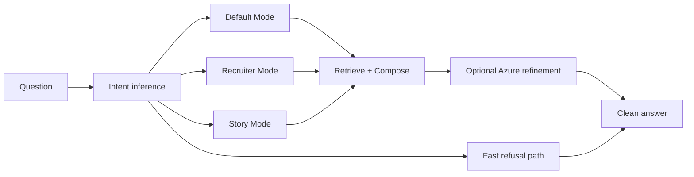

# AI System — Logmoth / Ask The Archive

> Public-safe documentation of the Logmoth assistant architecture. No private archive content, prompts, or implementation code.

## Overview

**Logmoth** is the archive-native assistant behind **Ask The Archive**. It answers public-safe questions about Kaviya's projects, experience, skills, role-fit, personality, blogs, and build history.

Logmoth is designed to feel like part of the archive — not a generic chatbot embed. Answers are grounded, professional, and never leak implementation details.

---

## Structured local archive

The assistant draws from a **structured local archive** of public-safe records. Each record represents a discrete piece of portfolio knowledge: a project, a skill area, an experience entry, a blog post summary, or a personality/build-history note.

Properties of the archive layer:

- Records are structured, not free-form documents
- Content is curated for public consumption — no private workplace details, no confidential data
- The archive never ships to the client; retrieval happens server-side only
- Records are the single source of truth for grounded answers

---

## Deterministic retrieval

When a question requires archive knowledge, the system performs **local deterministic archive search**:

1. Intent and mode are inferred from the question
2. Relevant archive records are retrieved by matching against structured fields
3. Retrieval is fast, predictable, and does not depend on network calls
4. No internet browsing — the assistant only knows what is in the archive

This is retrieval-augmented generation thinking without exposing RAG internals to the visitor.

---

## Deterministic answer composer

Retrieved records feed a **deterministic answer composer** that assembles structured responses:

- Answers are composed from archive facts, not generated from scratch
- Composition rules vary by mode (Default, Recruiter, Story)
- The composer produces a complete answer before any LLM involvement
- This ensures fallback-safe responses even when Azure is unavailable

The composer is the backbone of answer quality. Azure refinement polishes; the composer guarantees grounding.

---

## Azure AI Foundry refinement

When the composed answer would benefit from more natural professional wording, the system optionally sends it to **Azure AI Foundry / Azure OpenAI** for refinement.

Refinement is:

- **Optional** — skipped for greetings, refusals, and answers that are already well-formed
- **Server-side only** — no client-exposed API keys or endpoints
- **Bounded** — refinement improves wording; it does not add facts not present in the composed answer
- **Mode-aware** — Recruiter Mode responses get professional polish; Story Mode responses stay warm

---

## Local fallback

If Azure refinement fails (timeout, rate limit, service unavailable), the system returns the **deterministic composed answer** as-is.

Fallback behavior:

- Invisible to the visitor — no error messages in the chat UI
- The composed answer is always complete and grounded
- No retry storms or degraded UX states
- Production reliability does not depend on cloud availability

---

## Safe refusals

Logmoth enforces **private-boundary logic** for out-of-scope prompts:

| Category | Response |
|---|---|
| Private personal details | Polite refusal |
| Confidential workplace information | Polite refusal |
| Inappropriate content | Polite refusal |
| Requests for source code or implementation | Redirect to public showcase docs |
| Internet browsing / real-time data | Explanation that Logmoth only knows the archive |

Refusals are handled on the fast local path — no retrieval, no Azure call.

---

## No visible debug or source metadata

Visitors see clean answers. They never see:

- Raw archive record IDs or field names
- Source cards or citation blocks
- Debug panels or confidence scores
- System prompts or pipeline stage indicators
- Retrieval match details

This is a deliberate product decision: the assistant should feel like a knowledgeable guide, not a RAG demo.

---

## No internet browsing

Logmoth does not browse the internet, access real-time data, or call external APIs beyond Azure refinement. Its knowledge boundary is the local archive — curated, public-safe, and complete for portfolio purposes.

---

## Mode summary

| Mode | Example questions | Tone |
|---|---|---|
| Default | "What is SignalForge?" | Informative, technical |
| Recruiter | "Is Kaviya a good fit for a senior frontend role?" | Professional, role-focused |
| Story | "How did you get into building?" | Warm, narrative |

---

## Security and privacy

- No client-exposed secrets or API keys
- No private archive data in responses
- No confidential workplace details
- Azure credentials managed server-side via environment configuration (not in this repository)
- Source code and archive records remain in the private repository

See [qa-summary.md](./qa-summary.md) for the full security checklist.
