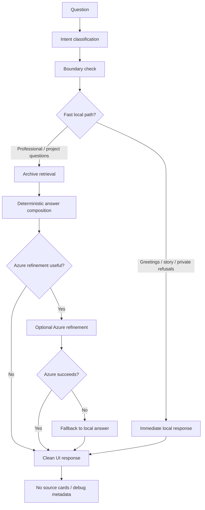

# AI System — Logmoth / Ask The Archive

> Public-safe documentation. No private archive content, prompts, or implementation code.

## Overview

**Logmoth** powers **Ask The Archive**. It answers public-safe questions about projects, experience, skills, role-fit, personality, field notes, and build history.

It is designed to feel like part of the archive — not a generic chatbot embed. Answers are grounded, professional, and never leak implementation details. There is no chat TTS.

---

## Structured local archive

The assistant draws from a **structured local archive** of public-safe records: projects, skill areas, experience entries, field-note summaries, and personality / build-history notes.

- Records are structured, not free-form dumps
- Content is curated for public consumption
- The archive never ships to the client; retrieval is server-side only
- Records are the single source of truth for grounded answers

---

## Answering pipeline

### Deterministic retrieval

1. Intent and mode are inferred from the question
2. Relevant archive records are matched against structured fields
3. Retrieval is local, fast, and network-independent
4. No internet browsing — Logmoth only knows the archive

### Deterministic answer composer

Retrieved records feed a composer that assembles structured responses:

- Answers are composed from archive facts, not invented from scratch
- Composition rules vary by mode (Default, Recruiter, Story)
- A complete answer exists before any LLM involvement
- Fallback remains safe even when Azure is unavailable

### Azure AI Foundry refinement

When wording would benefit from professional polish, the composed answer may be refined via **Azure AI Foundry / Azure OpenAI**:

- Optional — skipped for greetings, refusals, and already-strong answers
- Server-side only — no client-exposed keys
- Bounded — improves wording; does not invent new facts
- Mode-aware — Recruiter Mode stays professional; Story Mode stays warm

### Local fallback

If Azure fails (timeout, rate limit, unavailable), the deterministic composed answer returns as-is. Fallback is invisible in the chat UI.

---

## Internal modes

| Mode | Example questions | Tone |
|---|---|---|
| **Default Mode** | “What is SignalForge?” | Informative, technical |
| **Recruiter Mode** | “Is Kaviya a good fit for a senior frontend role?” | Professional, role-focused |
| **Story Mode** | “How did you get into building?” | Warm, narrative |

---

## Safe refusals

| Category | Response |
|---|---|
| Private personal details | Polite refusal |
| Confidential workplace information | Polite refusal |
| Inappropriate content | Polite refusal |
| Source code / implementation requests | Redirect to public showcase docs |
| Internet browsing / real-time data | Explanation that Logmoth only knows the archive |

Refusals use the fast local path — no retrieval, no Azure call.

---

## Clean UI contract

Visitors never see:

- Raw archive record IDs or field names
- Source cards or citation blocks
- Debug panels or confidence scores
- System prompts or pipeline stage indicators
- Retrieval match details

The assistant should feel like a knowledgeable guide, not a RAG demo.

---

## Security and privacy

- No client-exposed secrets or API keys
- No private archive data in responses
- No confidential workplace details
- Azure credentials managed server-side (not in this repository)
- Source code and archive records remain in the private repository

See [qa-summary.md](./qa-summary.md) for the security checklist.
