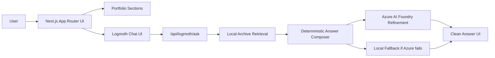
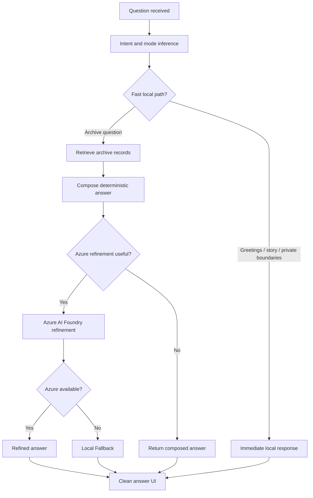
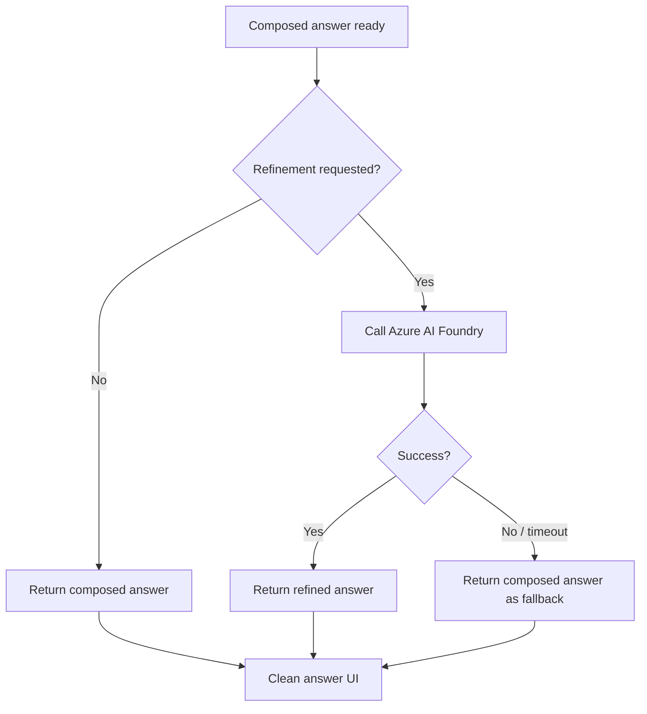
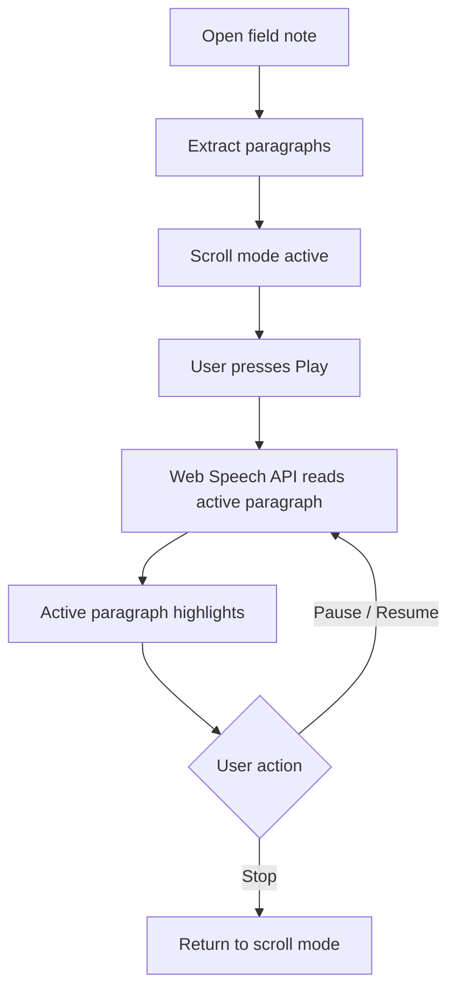
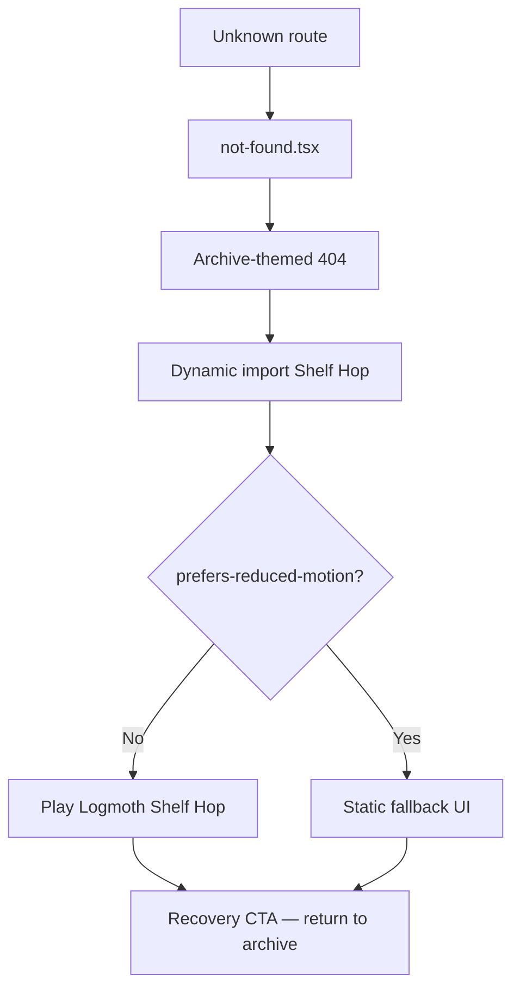

# Architecture — The Build Archive

> Public-safe architecture overview. No implementation code, secrets, or private archive content.

## High-level architecture

The Build Archive is a Next.js 16 App Router application deployed on Vercel. The UI is an editorial single-page portfolio with lazy-mounted sections, a grounded AI assistant (Logmoth), browser-native blog narration, and isolated error-page experiences.

### Stack

| Layer | Technology |
|---|---|
| Framework | Next.js 16 (App Router) |
| UI | React, TypeScript, Tailwind CSS |
| Motion | Framer Motion |
| Hosting | Vercel |
| AI refinement | Azure AI Foundry / Azure OpenAI |
| Retrieval | Local deterministic archive search |
| Narration | Browser Web Speech API |

### Key boundaries

- **Portfolio shell** — editorial sections, project modals, blog reader
- **AI layer** — Logmoth chat UI + `/api/logmoth/ask` API route
- **Archive layer** — structured local records, never exposed to the client
- **Error layer** — `not-found.tsx`, custom error pages, dynamically imported Shelf Hop

---

## Logmoth architecture

Logmoth (Ask The Archive) is the archive-native assistant. Every question flows through a deterministic pipeline before optional cloud refinement.

### Internal modes

| Mode | Triggered by | Behavior |
|---|---|---|
| **Default Mode** | General project, skill, experience questions | Standard archive retrieval and composition |
| **Recruiter Mode** | Role-fit, hiring, strengths framing | Professional tone, hiring-relevant emphasis |
| **Story Mode** | Personality, build history, narrative questions | Warmer, story-led responses from archive records |

### Design principles

- Compose deterministically first; refine only when it adds value
- Never expose debug metadata, source cards, or raw archive records to the client
- Fast-path greetings, story prompts, and private-boundary refusals without retrieval
- All Azure calls are server-side; no client-exposed API keys

---

## Fallback flow

Azure refinement is an enhancement, not a dependency.

The visitor always receives a clean answer. Fallback is invisible — no error states, no "AI unavailable" messages in the chat surface.

---

## Blog narration flow

Field notes support browser-native paragraph narration without paid TTS.

### Design notes

- Scroll mode and audio mode are intentionally separate states
- Paragraph-level sync: highlight follows the spoken paragraph
- No ElevenLabs, no paid TTS, no external audio API
- Stop always returns to scroll mode cleanly

---

## Error page flow

Unknown routes land on a branded 404 with an optional mini game.

### Design notes

- Shelf Hop is dynamically imported — zero homepage bundle cost
- `prefers-reduced-motion` bypasses the game entirely
- Recovery CTA routes visitors back to the main archive
- Creative loading and error pages share the archive visual language

---

## Performance architecture

| Technique | Purpose |
|---|---|
| Hero image priority | LCP optimization |
| Lazy-mounted sections | Reduced initial JS and layout work |
| Hash navigation fix | CLS stability on section scroll |
| Logmoth lightweight client | No heavy AI SDKs in the browser |
| Dynamic import for Shelf Hop | Error delight isolated from main bundle |
| Reduced motion respect | Accessibility across all animated surfaces |

See [qa-summary.md](./qa-summary.md) for final Lighthouse scores and QA status.
