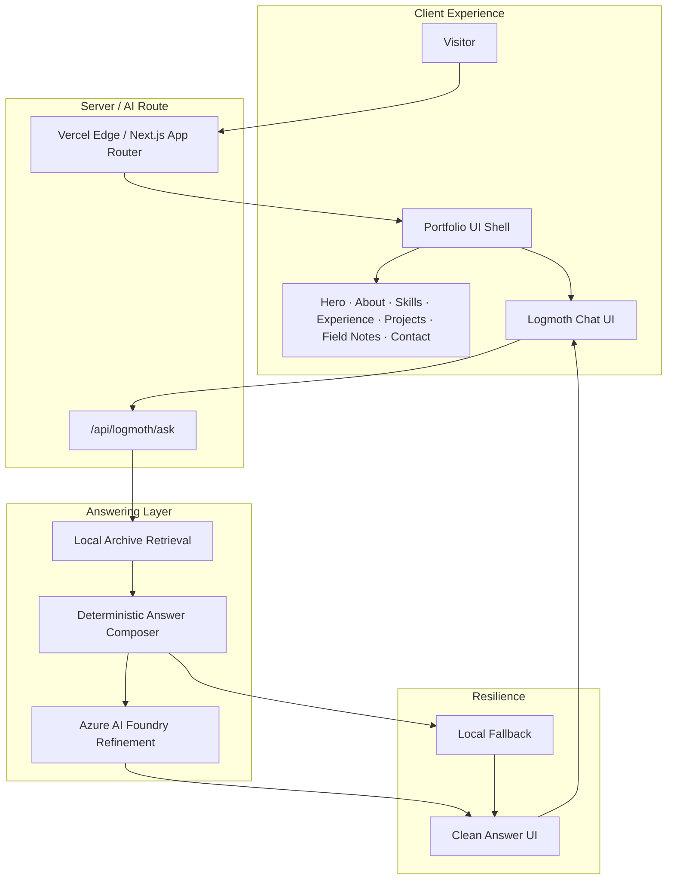
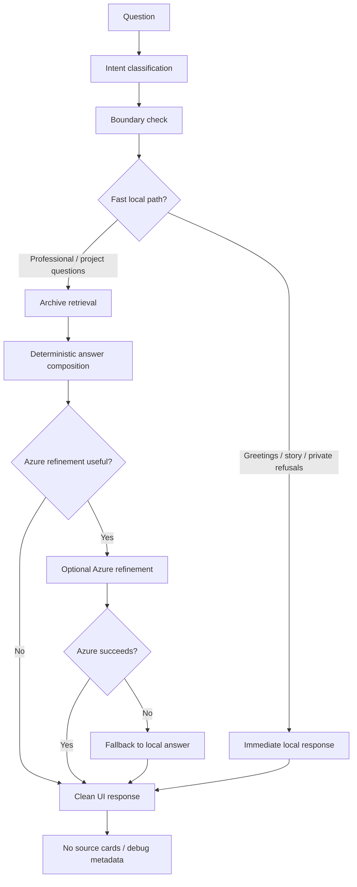
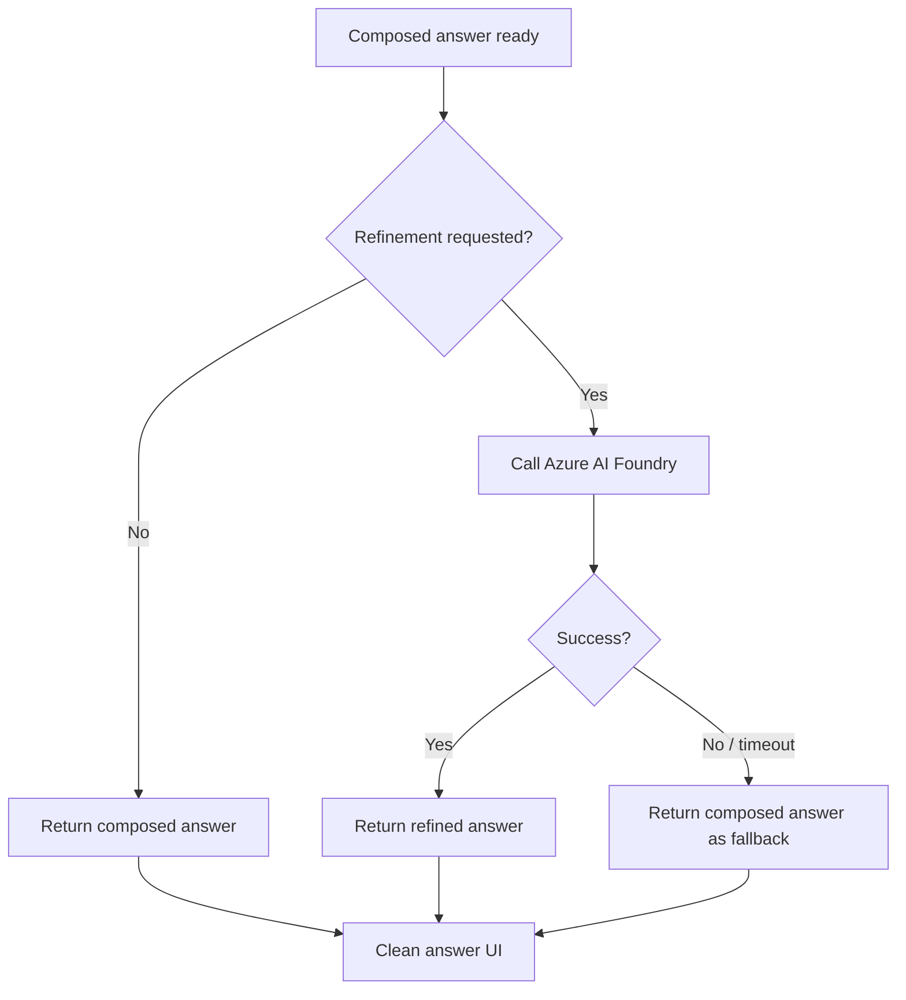
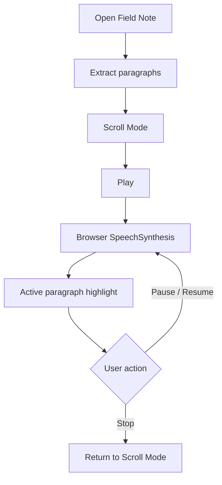
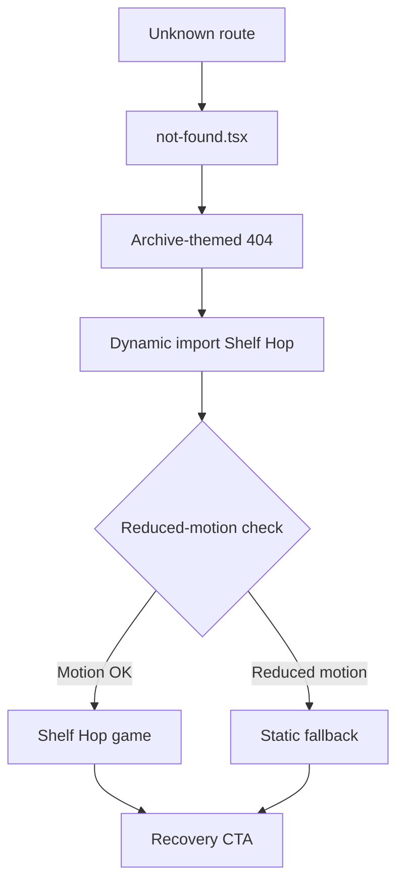

# Architecture — The Build Archive

> Public-safe architecture overview. No implementation code, secrets, or private archive content.

## Stack

| Layer | Technology |
|---|---|
| Framework | Next.js 16 (App Router) |
| UI | React, TypeScript, Tailwind CSS |
| Motion | Framer Motion |
| Hosting | Vercel |
| AI refinement | Azure AI Foundry / Azure OpenAI |
| Retrieval | Local deterministic archive search |
| Narration | Browser Web Speech API |

## Boundaries

- **Portfolio shell** — editorial sections, project modals, field notes
- **AI layer** — Logmoth chat UI + `/api/logmoth/ask`
- **Archive layer** — structured local records, never shipped to the client
- **Error layer** — `not-found.tsx`, custom error pages, dynamically imported Shelf Hop

---

## High-level product architecture

---

## Logmoth answering pipeline

### Internal modes

| Mode | Triggered by | Behavior |
|---|---|---|
| **Default Mode** | Project, skill, experience questions | Standard retrieval and composition |
| **Recruiter Mode** | Role-fit, hiring, strengths | Professional tone, hiring-relevant emphasis |
| **Story Mode** | Personality, build history | Warmer, story-led responses from archive records |

### Design principles

- Compose deterministically first; refine only when it adds value
- Never expose debug metadata, source cards, or raw archive records
- Fast-path greetings, story prompts, and private-boundary refusals
- All Azure calls are server-side; no client-exposed API keys

---

## Fallback flow

Azure refinement is an enhancement, not a dependency.

The visitor always receives a clean answer. Fallback is invisible — no “AI unavailable” messaging in the chat surface.

---

## Blog narration flow

- Scroll Mode and Audio Mode are separate states
- Paragraph-level sync between speech and highlight
- No ElevenLabs, no paid TTS, no external audio API
- Closing the modal cancels narration

---

## Error page lazy-load flow

- Shelf Hop is dynamically imported — zero homepage bundle cost
- `prefers-reduced-motion` bypasses the game
- Recovery CTA returns visitors to the main archive

---

## Performance architecture

| Technique | Purpose |
|---|---|
| Hero image priority / `fetchPriority` | LCP optimization |
| Lazy-mounted sections | Reduced initial JS and layout work |
| Hash navigation stability | CLS under 0.1 |
| Lightweight Logmoth client | No heavy AI SDKs in the browser |
| Dynamic import for Shelf Hop | Error delight isolated from main bundle |
| Reduced motion respect | Accessibility across animated surfaces |

Architecture animation → `assets/gifs/architecture-flow.gif` (+ `.mp4`)  
Storyboard → [architecture-flow-storyboard.md](../assets/diagrams/architecture-flow-storyboard.md)  
QA scores → [qa-summary.md](./qa-summary.md)
